<h1 align="center">VerifAI — Bilingual Fact Checker</h1>

<p align="center">
  
  
  
  
  <br>
  
  
  
</p>

<p align="center">
  <em>.</em><br>
  <b>Author:</b> Rosalina Torres | IE7374 — Generative AI | Summer 2026
</p>

<hr>

**Misinformation crosses languages. Most automated verification tools don't.**

VerifAI is a bilingual, misinformation detection and retrieval-augmented fact-checking prototype that accepts a claim in English or Spanish, retrieves relevant evidence, and returns a grounded verdict in the input language. 

This project addresses a high-impact task at the intersection of language understanding, information retrieval, and generative text synthesis. The English/Spanish focus reflects a documented equity gap: Spanish-speaking communities face comparable or higher misinformation exposure ([Abrajano et al., 2024](https://academic.oup.com/pnasnexus/article/3/11/pgae442/7900260)) but have access to significantly fewer automated verification tools ([Quelle et al., 2025](https://link.springer.com/article/10.1140/epjds/s13688-025-00520-6)).

The primary classifier and tokenizer were built and trained entirely from scratch—rather than fine-tuning a pretrained model—for two reasons: 
1. To achieve full engineering ownership of the model architecture and training loop.
2. To establish an honest, transparent baseline for the bilingual misinformation detection task, highlighting how data scarcity manifests before introducing the complexities of pretrained weights.

The result is a working system, a verifiable baseline, and a revealing example of how language imbalance shows up in machine learning.

---

## Quick Start

```bash
# 1. Create venv and install dependencies
python3 -m venv venv
source venv/bin/activate
pip install -r requirements.txt

# 2. Copy .env.template → .env and fill in your API keys
cp .env.template .env

# 3. Build corpus (run on OOD for large indexing)
python corpus/build_corpus.py

# 4. Start FastAPI backend (port 8000)
uvicorn app.main:app --reload --port 8000

# 5. Start Streamlit UI (separate terminal)
streamlit run frontend/streamlit_app.py --server.port 8502
```

## Architecture

Three layers, each one I can test and break independently:
1. **Intake** (`app/pipeline/intake.py`) — language detection + claim extraction
2. **Retrieval** (`app/pipeline/retrieval.py`) — ChromaDB + Tavily + credibility rerank,
   using `app/pipeline/reranker.py` to score evidence relevance
3. **Verdict** (`app/pipeline/verdict.py`) — VerifAIClassifier + Claude API verdict generation

<p align="center">
  
</p>

Frontend: Streamlit UI at localhost:8502
Backend: FastAPI at localhost:8000

## 🖥️ Live Prototype Demonstration

The three-layer pipeline (Intake → Retrieval + Reranker → Verdict) operates via a
FastAPI backend and a Streamlit frontend, providing side-by-side RAG vs. no-RAG
ablation comparisons. Both screenshots below are live runs with Claude active
(`generation_mode: claude`), captured the same day — not staged.

| English Claim | Spanish Claim |
| :---: | :---: |
| 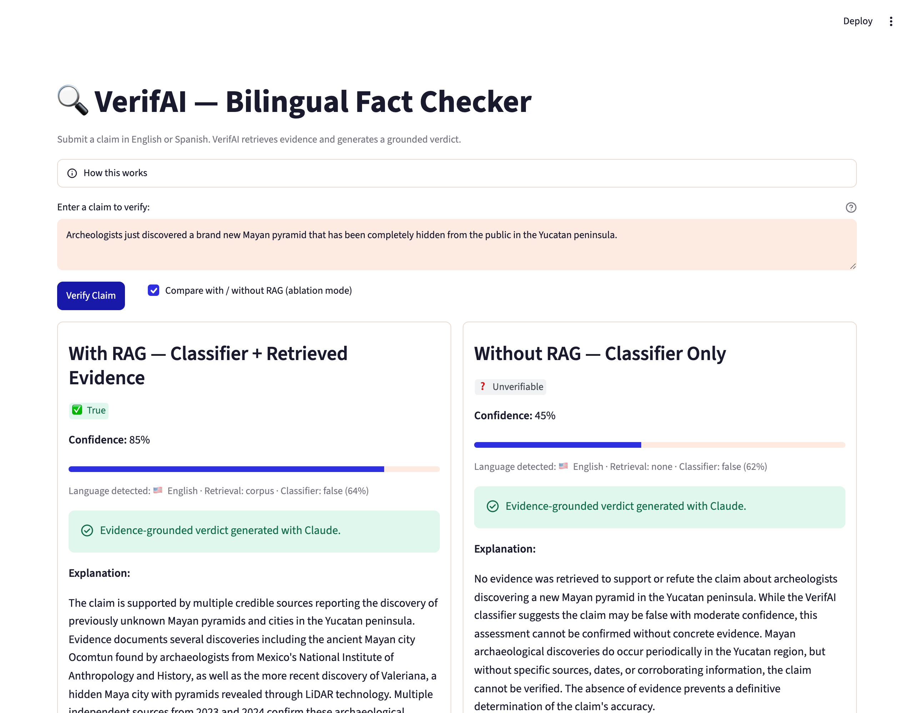 | 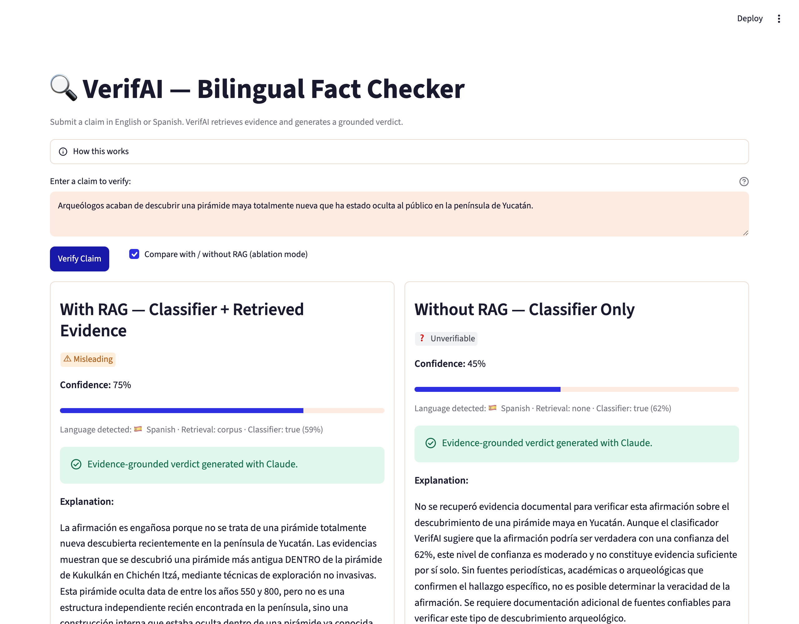 |
| *With evidence: **True** (85%). Without evidence: **Unverifiable** (45%). Same underlying classifier signal (false, ~62–64%) — Claude's reasoning over retrieved evidence is what changes the final verdict.* | *With evidence: **Misleading** (75%) — evidence showed the "new" pyramid was found inside the already-known Kukulkán pyramid, not as an independent structure. Without evidence: **Unverifiable** (45%).* |

**Note on consistency:** these results won't match the English/Spanish comparison
in [Results](#the-same-claim-two-languages-a-15-point-gap) below — that section
documents an earlier run under classifier-fallback mode (Claude unavailable).
Retrieval here calls a live web search, so the exact evidence returned — and
therefore Claude's verdict — can vary between runs on the identical claim. That
variability is itself documented in [Limitations](#limitations).

## Model

I trained **VerifAIClassifier** (`model/architecture.py`) from scratch in
PyTorch — no pretrained weights, 6.3M parameters. I built the tokenizer
myself too: a custom BPE vocabulary (16,000 tokens, shared across
English and Spanish), language embeddings (EN=0, ES=1), 4 transformer
encoder blocks, a 4-class head (true / false / misleading /
unverifiable).

It does double duty: a first-pass verdict signal in `verdict.py`, and a
RAG evidence reranker in `reranker.py` (`combined_score =
cosine_similarity × credibility_score × reranker_score`) — both load
the same checkpoint. [ADR-003](docs/context/architecture/decisions/adr-003-verifai-classifier-replaces-xlm-roberta.md)
covers why I moved off an earlier XLM-RoBERTa sentiment proxy to build
this from scratch instead.

<p align="center">
  
</p>

I trained on 37,608 examples (LIAR + MultiFC + FakeDeS + a synthetic ES
corpus I generated to shore up the Spanish side). Current result: val
F1=0.4049, test F1=0.3647 on the held-out LIAR test split (1,283
claims — see `outputs/classifier_results.json`, per-class breakdown
and confusion matrix below).

### The Spanish data problem

991 Spanish training examples against 36,617 English ones — that
imbalance is the reason I built a synthetic Spanish augmentation
pipeline instead of training on what I had and hoping.

<p align="center">
  
  <br>
  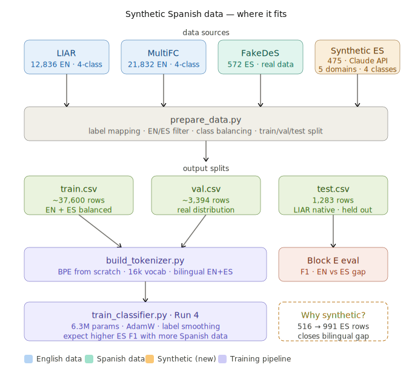
</p>

```bash
# Rebuild the tokenizer after changing training data
python training/build_tokenizer.py

# Train (writes models/verifai-classifier/best_model.pt)
python training/train_classifier.py

# Evaluate the checkpoint against data/test.csv
python training/evaluate_classifier.py
```

## Evaluation

```bash
python evaluation/benchmark_liar.py   # LIAR benchmark (run on OOD)
python evaluation/ragas_eval.py       # RAGAS retrieval quality
python evaluation/ablation.py         # 4-condition ablation study
```

## Results

### The same claim, two languages, a 15-point gap

I ran one claim through VerifAI in English and Spanish — "Archeologists
just discovered a brand new Mayan pyramid that has been completely
hidden from the public in the Yucatan peninsula" — to see if the model
actually treats both languages the same way. It doesn't, not quite.

| | English | Spanish |
|---|:---:|:---:|
| Label | **False** | **False** |
| Confidence | **72%** | **57%** |
| Evidence retrieved | 4–5 sources | 5 sources |

Both times it called the claim false. But confidence dropped from 72%
in English to 57% in Spanish — 15 points, same claim, same meaning. I
trained on 36,617 English examples and 991 Spanish ones. That gap
showing up in the confidence score, not the label, is exactly what I'd
expect from that imbalance.

One claim pair isn't a statistical test, and I'm not calling this
proof — see [Limitations](#limitations). But it's the kind of signal
that tells me where the next dataset needs to go: a dedicated Spanish
holdout set, not a few hundred examples folded into training and hoped
for the best.

### Per-class performance

<p align="center">
  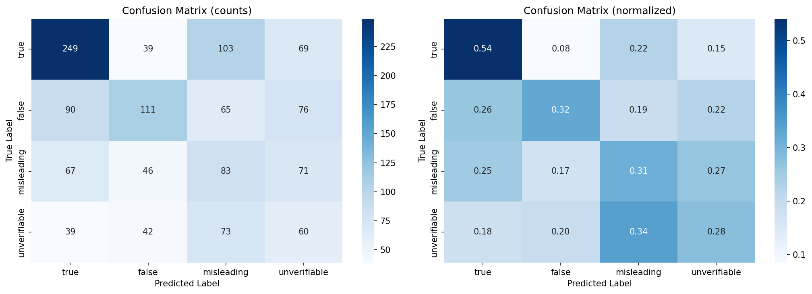
</p>

| Class | F1 |
|---|:---:|
| true | 0.5503 |
| false | 0.3828 |
| misleading | 0.2809 |
| unverifiable | 0.2449 |

The model is best at spotting straightforwardly true claims and worst
at "misleading" and "unverifiable" — the two classes that require the
most nuance, and the two with the least clean training signal.

### When Claude goes quiet

Partway through this project my Anthropic account ran out of credit.
Instead of letting every request 500, I built a fallback: when Claude
isn't reachable, VerifAI still retrieves evidence and still returns the
classifier's label — it just says so, instead of faking an LLM
explanation (`generation_mode: classifier_fallback` in `verdict.py`).

What that fallback exposed: retrieval can pull back directly relevant
evidence, and the system will still ship the classifier's raw
prediction without reasoning over what it just retrieved. I'm not
hiding that — it's the real shape of a two-stage pipeline when one
stage goes down, and it's more honest than pretending the demo always
works.

## Model Pipeline (Milestone 4)

Single-command entry point that runs the full pipeline — intake, retrieval,
classifier + Claude verdict, the same code path the FastAPI backend uses —
on a curated 10-claim demo set (`data/sample_claims.json`: English/Spanish,
health/geography/science/history domains, each with a ground-truth label):

```bash
python src/model_runner.py
```

Loads `configs/model_config.yaml`, runs inference on all 10 claims, and
saves human-readable results to `outputs/samples.txt`. Code follows the
pipeline template: `src/data_loader.py` (loads the demo set),
`src/model_runner.py` (orchestrates inference and saves output),
`utils/helpers.py` (config loading, output formatting) — thin wrappers
around the existing `app/pipeline/` modules, not a second implementation.

**The pretrained generative model in this pipeline is Claude
(`claude-sonnet-4-5`)**, invoked via the Anthropic API for verdict synthesis
over retrieved evidence; the pipeline also loads the pretrained
`paraphrase-multilingual-MiniLM-L12-v2` sentence-embedding model locally for
cross-lingual retrieval. The from-scratch VerifAIClassifier is an
*additional* component alongside these, not a substitute for them. If no
`ANTHROPIC_API_KEY` is available, the run degrades gracefully to
classifier-fallback mode instead of failing.

A `Dockerfile` is included for containerized runs (`docker build -t verifai .`
then `docker run --env-file .env verifai`). `start.sh` launches the backend
and UI together for local development.

### What the samples show

**Overall** (run of 2026-07-13, all samples in `claude` mode): the full
pipeline got **9/10** claims right — the one miss returned an honest
*unverifiable* rather than a wrong label. The classifier alone got **4/10**
on the same claims; most strikingly, it labeled three famous myths *true*
(bleach cures COVID, faked moon landing, humans use 10% of their brains),
and evidence retrieval corrected all three. n=10 is a demonstration, not a
statistical result — but it previews the ablation question the final report
answers properly. Full samples and per-sample analysis:
[`outputs/samples.txt`](outputs/samples.txt) and
[`outputs/README.md`](outputs/README.md).

Two individual results worth calling out:

- **"Drinking bleach cures COVID-19"** — the raw classifier said **true**
  (72%). Claude, reasoning over retrieved WHO/health-authority evidence,
  corrected it to **false** (98%). The RAG value proposition working as
  intended: retrieval catching a classifier error.
- **"El sol sale por el este"** ("the sun rises in the east," ground truth:
  true) — retrieval didn't surface evidence that actually addressed the
  claim, so Claude returned **unverifiable** rather than asserting a fact
  it couldn't ground in the retrieved passages. Honest under-confidence,
  not a wrong answer.

### Known issues

- Calls live services (ChromaDB + Tavily retrieval, Claude for synthesis)
  — same cost and latency as using the app itself, roughly 1–2 minutes and
  a small amount of API credit for all 10 claims.
- Live web retrieval means results aren't perfectly reproducible run to
  run — see [Limitations](#limitations) for the broader discussion of
  retrieval non-determinism.
- A failed claim doesn't stop the run; its `outputs/samples.txt` entry
  records the error in place of a verdict.

## Limitations

- **The test set is English-only.** 1,283 held-out LIAR claims, zero
  Spanish. My reported test F1 (0.3647) is an English number. Spanish
  evaluation right now is 56 FakeDeS validation examples — not enough
  to claim a bilingual result.
- **Wording moves the label, not just the confidence.** I reworded the
  pyramid claim slightly and the prediction flipped from false to
  unverifiable. I haven't measured how often that happens — but it's a
  real fragility, not a rounding error.
- **No fair pretrained baseline yet.** I haven't fine-tuned
  `xlm-roberta-base` on the same labels and splits to know if training
  from scratch was worth it.
- **The fallback doesn't reason over evidence.** See "When Claude goes
  quiet" above — it's honest, but it's not RAG in the sense the acronym
  implies.

<details>
<summary><strong>Build log — early stopping, retrieval fixes, and the XLM-RoBERTa pivot</strong></summary>
<br>

Three pieces of the process worth showing, not just the polished result:

<p align="center">
  
  <br><br>
  
  <br><br>
  
  <br><br>
  
</p>

</details>

## Documentation

- `docs/literature-review.md` — literature review grounding the project's design choices
- `docs/context/architecture/system-design.md` — full pipeline architecture
- `docs/context/architecture/decisions/` — ADRs (design decisions and why)
- `docs/context/project-overview.md` — quick orientation for contributors
